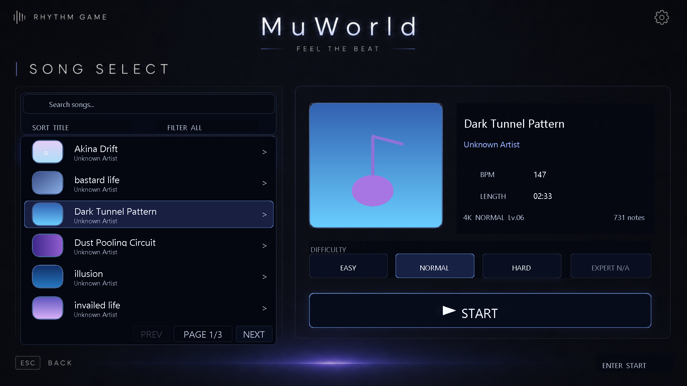

# MuWorld 사용자 안내서

MuWorld는 Windows에서 즐길 수 있는 로컬 리듬게임입니다.

인터넷 대전 게임이 아니며, 내 컴퓨터에 저장된 음악과 패턴을 이용해 플레이합니다. 곡을 선택하고 화면 아래 판정선에 노트가 도착하는 순간 해당 키를 누르면 됩니다.

## 게임 미리보기

[](media/test.mp4)

## 가장 빠르게 시작하기

1. `MuWorld` 폴더 안의 `run.bat`를 더블클릭합니다.
2. 검은색 창에서 빌드가 끝날 때까지 기다립니다.
3. 게임이 열리면 메인 화면에서 `PLAY`를 선택합니다.
4. 원하는 곡, 난이도, 레인 수를 선택하고 게임을 시작합니다.

처음 실행할 때 필요한 프로그램이 없으면 자동 설치를 시도합니다. 이때는 인터넷 연결이 필요하며 몇 분 정도 걸릴 수 있습니다. 이후에는 보통 인터넷 연결 없이 실행할 수 있습니다.

> 게임 폴더 안의 `front interface` 폴더나 파일 이름을 바꾸면 실행되지 않을 수 있습니다.

## 권장 환경

- Windows 10 또는 Windows 11
- 키보드와 스피커 또는 이어폰
- 1920×1080(FHD) 해상도 권장
- 게임과 추가할 음악을 저장할 수 있는 여유 공간

화면 배치는 FHD를 기준으로 만들어졌으며, 다른 해상도에서도 화면 크기에 맞춰 조절됩니다.

## 기본 조작

### 메뉴

- 마우스: 항목 선택
- 방향키 또는 `Tab`: 메뉴 이동
- `Enter` 또는 `Space`: 선택
- `Esc`: 이전 화면 또는 게임 종료

### 플레이 키

| 레인 모드 | 기본 키 |
|---|---|
| 4K | `D` `F` `J` `K` |
| 5K | `D` `F` `Space` `J` `K` |
| 6K | `S` `D` `F` `J` `K` `L` |
| 7K | `S` `D` `F` `Space` `J` `K` `L` |

플레이 중 `Esc`를 누르면 일시정지할 수 있습니다. 키가 불편하면 설정의 `CONTROLS`에서 레인별 키를 변경할 수 있습니다.

## 노트 종류

- `Tap`: 판정선에 맞춰 키를 한 번 누릅니다.
- `Long`: 시작점에서 키를 누르고 끝까지 유지합니다.
- `Slide`: 시작 레인의 키를 누른 뒤 표시된 끝 레인까지 이어서 입력합니다.

판정은 `PERFECT`, `GREAT`, `BETTER`, `GOOD`, `BAD`, `MISS` 순으로 표시됩니다.

- `EARLY`: 키를 조금 일찍 눌렀습니다.
- `LATE`: 키를 조금 늦게 눌렀습니다.
- `SYNC`: 타이밍이 잘 맞았습니다.

플레이 중 노트를 맞혀도 별도의 비프음은 나오지 않습니다. 음악과 화면의 판정 표시를 기준으로 플레이하면 됩니다.

## 곡 선택하기

곡 선택 화면에서는 다음 항목을 정할 수 있습니다.

- 플레이할 곡
- `Easy`, `Normal`, `Hard` 난이도
- 4K, 5K, 6K, 7K 레인 모드
- 노트 속도
- 즐겨찾기

난이도를 바꿔도 현재 선택한 곡은 그대로 유지됩니다.

## 내 음악 추가하기

1. 아래 폴더를 엽니다.

   ```text
   MuWorld\front interface\Songs\InGameBGM\Original
   ```

2. 원하는 음악 파일을 폴더에 넣습니다.
3. 게임의 곡 선택 화면에서 `RESCAN`을 선택하거나 게임을 다시 실행합니다.
4. 패턴 생성이 끝난 뒤 곡을 선택해 플레이합니다.

지원하는 음악 파일:

- WAV
- MP3
- OGG
- FLAC

새 음악을 넣으면 게임이 `Easy`, `Normal`, `Hard`와 4K~7K용 패턴을 미리 생성합니다. 곡 길이에 따라 시간이 조금 걸릴 수 있습니다.

`CHART PREPARING`이 표시되면 오류가 아니라 패턴을 준비하는 중입니다. 준비가 끝날 때까지 잠시 기다린 뒤 다시 시작해 주세요. 생성된 패턴은 저장되므로 플레이할 때마다 다시 만들지 않습니다.

MP3, OGG, FLAC의 자동 분석에는 `ffmpeg`가 필요할 수 있습니다. 패턴이 생성되지 않는 곡이 있다면 WAV 형식으로 변환해 다시 시도하는 것이 가장 간단합니다.

## 설정

메인 화면 오른쪽 위의 톱니바퀴를 선택하면 설정 화면이 열립니다.

설정할 수 있는 주요 항목:

- 음악과 효과음 볼륨
- 노트 속도
- 입력 타이밍 보정
- Normal, Practice, Auto 플레이 모드
- 레인 수와 키 설정
- 해상도와 화면 주사율
- 렌더링 품질과 VSync
- 글자 크기
- 고대비, 색각 보정, 움직임 감소

### 타이밍이 맞지 않을 때

노트를 정확히 눌렀는데 계속 `EARLY` 또는 `LATE`가 나온다면 설정에서 `CALIBRATE`를 실행하세요.

1. 평소 사용하는 이어폰이나 스피커를 연결합니다.
2. `CALIBRATE`를 시작합니다.
3. 들리는 박자에 맞춰 안내된 키를 누릅니다.
4. 저장된 보정값으로 다시 플레이합니다.

오디오 장치를 바꾸면 지연 시간이 달라질 수 있으므로 다시 보정하는 것이 좋습니다.

## 플레이 결과

곡이 끝나면 다음 정보를 확인할 수 있습니다.

- 점수와 정확도
- 등급
- 최대 콤보
- 판정 분포
- 빠르게 또는 늦게 누르는 경향
- 노트를 놓친 구간
- 다음 플레이에서 집중할 부분

게임 기록과 설정은 Windows 사용자 폴더에 자동 저장됩니다.

```text
%LOCALAPPDATA%\RhythmGame
```

## 화면이 끊길 때

고밀도 곡이나 높은 화면 주사율에서는 컴퓨터 성능에 따라 프레임이 떨어질 수 있습니다. 다음 순서로 설정을 바꿔 보세요.

1. 프레임레이트를 `60 FPS`로 설정합니다.
2. 렌더링 품질을 `BAL`로 설정합니다.
3. VSync를 켜거나 끈 상태를 각각 비교합니다.
4. 백그라운드에서 실행 중인 무거운 프로그램을 종료합니다.
5. 게임을 다시 실행합니다.

MuWorld는 곡 패턴을 미리 생성해서 저장하고, 플레이 중에는 저장된 패턴을 읽습니다. 따라서 새 곡의 패턴 준비가 끝난 뒤에도 끊김이 심하다면 렌더링 설정을 먼저 조절하는 것이 좋습니다.

## 자주 발생하는 문제

### `run.bat`를 눌러도 실행되지 않아요

- 인터넷 연결을 확인하고 다시 실행해 보세요.
- Windows 보안 경고가 나오면 파일이 이 폴더에서 만들어진 것이 맞는지 확인한 뒤 실행을 허용하세요.
- 이미 실행 중인 게임 창이 있다면 닫고 다시 시도하세요.

### 추가한 곡이 목록에 없어요

- 음악이 `front interface\Songs\InGameBGM\Original` 안에 있는지 확인하세요.
- 지원하는 확장자인지 확인하세요.
- 곡 선택 화면에서 `RESCAN`을 실행하세요.

### 곡을 선택했는데 시작되지 않아요

`CHART PREPARING`이 표시되는지 확인하세요. 새 곡의 패턴을 생성하는 동안에는 해당 곡이 바로 시작되지 않습니다.

### 음악과 노트 타이밍이 달라요

설정에서 `CALIBRATE`를 실행한 뒤 `Input Offset`을 조절하세요. 블루투스 이어폰은 지연이 클 수 있으므로 유선 이어폰이나 스피커와도 비교해 보세요.

### 설정이나 기록이 이상해요

게임을 완전히 종료한 뒤 다시 실행하세요. 문제가 계속되면 `%LOCALAPPDATA%\RhythmGame` 폴더의 설정 파일을 별도 위치에 백업한 후 점검해야 합니다.

## 한눈에 보는 시작 순서

```text
run.bat 실행
  → PLAY 선택
  → 곡 선택
  → 난이도와 레인 수 선택
  → 패턴 준비가 끝날 때까지 대기
  → 음악에 맞춰 키 입력
  → 결과 확인
```

즐겁게 플레이하세요!
